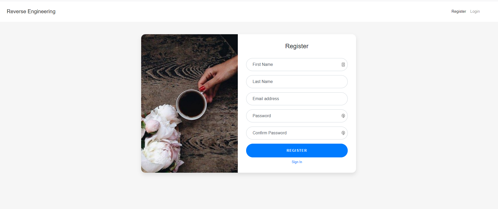

# Reverse Engineering


Reverse Engineering Code - UC Davis Coding BootCamp



## Description

This app allows users to create an account, log into the account and sign back out securely. all user data is stored in a mysql database.

## Table of Contents

- [Installation](#installation)

- [Usage](#usage)

- [License](#license)

- [Contributing](#contributing)

## Installation

To install necessary dependencies, run the following command:
​

```
npm i
```

## Usage

Run "node server.js" to start the server localhost:3000

## Demo

Visit to see my work: https://reverse-cm.herokuapp.com/
Login: email@mail.com Pass: 12345678

## License

This project is licensed under the MIT license.

## Contributing

​https://github.com/cynmojica1231/Homework14
